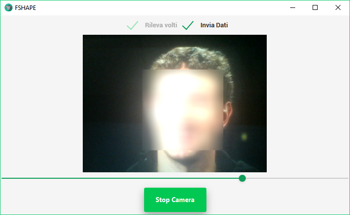

# Fshape - Dinosaur Collection
Face detection and censorship software developed in Java and OpenCV.
Back in June 2016 when i just wanted to play with computer vision and had just learnt Java in Highschool.
The software detects faces through the webcam and applies a blur filter. When moving the sliding bar the intesity of the blur filter varies. 

GUI screenshot 

-------------------------------------------------------------------------------------------------------
**Fshape is part of the Dinosaur Collection.**

**The Dinosaur Collection is composed by projects built at the beginning of my programming adventure.**

